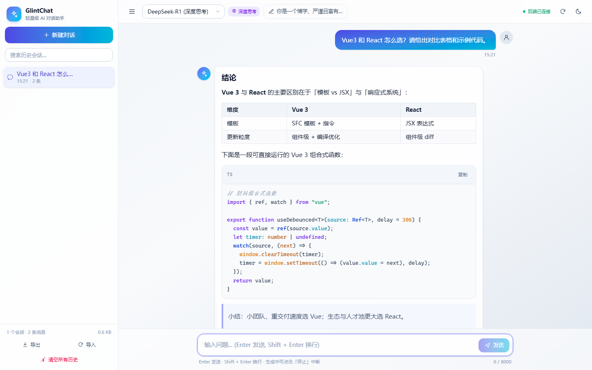
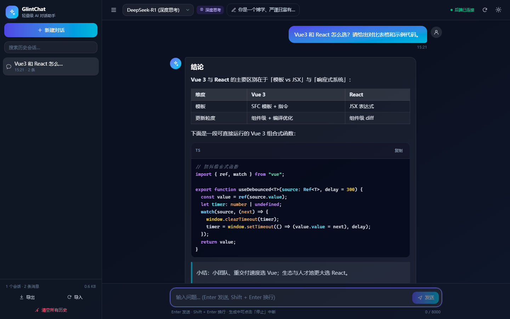
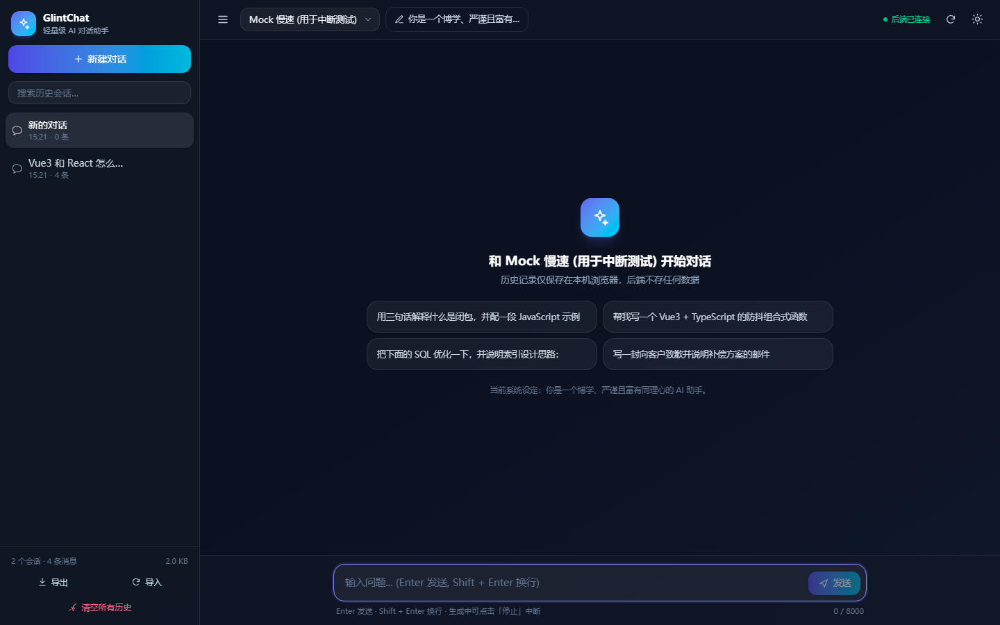

# GlintChat · 轻量级 AI 智能对话助手

无需数据库的全栈 AI 对话应用：**前端负责交互与持久化（localStorage），后端是无状态 API 代理（保管 Key、透传 SSE 流）**。

- 流式打字机输出（原生 `fetch` + `ReadableStream` 解析 SSE，非 EventSource，支持 POST）
- Markdown 渲染 + 代码高亮（marked + highlight.js + DOMPurify 消毒）+ 一键复制代码
- 思维链（DeepSeek-R1 `reasoning_content`）独立折叠面板，流式结束后自动收起
- 多会话管理：新建 / 搜索 / 重命名（双击标题）/ 删除 / 清空全部（二次确认）/ 导入导出 JSON
- Enter 发送、Shift + Enter 换行、中文输入法组词不误发、生成中可「停止」
- 自动底端对齐：用户上滑暂停跟随，滚回底部自动恢复
- 亮 / 暗主题、移动端抽屉式侧边栏、多标签页 localStorage 同步

## 0. 界面预览

| 亮色（含表格 / 代码高亮 / 思维链） | 暗色 |
| --- | --- |
|  |  |



---

## 1. 技术栈

| 层 | 选型 |
| --- | --- |
| 前端 | Vue 3.5（`<script setup>` + Composition API）、TypeScript 5.9、Vite 7、TailwindCSS v4 |
| 渲染 | marked 16、highlight.js 11（按需注册语言，避免 1MB 全量包）、DOMPurify 3 |
| 后端 | Node.js ≥ 20.19、Express 5、TypeScript、zod 校验、tsx（开发热重载） |
| 传输 | 服务端 `fetch` 流式读取上游 → SSE 透传（`text/event-stream`） |
| 存储 | 浏览器 `localStorage`（key：`ai_chat_sessions`），后端零状态 |

## 2. 目录结构

```
GlintChat/
├── client/                      # 前端（Vue 3 + Vite）
│   ├── index.html
│   ├── vite.config.ts           # 别名、Tailwind 插件、/api 代理（SSE 不缓冲）
│   └── src/
│       ├── App.vue              # 应用外壳：布局 + 流式编排 + 会话操作
│       ├── main.ts
│       ├── types.ts             # 与后端共享的类型与常量
│       ├── assets/              # main.css（设计令牌/组件类）、markdown.css（排版与高亮主题）
│       ├── components/          # Sidebar / AppHeader / ChatArea / MessageItem /
│       │                        # UserBubble / AssistantBubble / ThinkingPanel /
│       │                        # MessageActions / SystemPromptDialog / ConfirmDialog / Icon
│       ├── composables/         # useSessions / useAutoScroll / useConfirm / useTheme
│       └── utils/               # stream.ts（SSE 客户端）/ storage.ts / markdown.ts / uuid.ts
├── server/                      # 后端（Express 5 + TS）
│   ├── .env.example             # 环境变量模板（复制为 .env）
│   └── src/
│       ├── index.ts             # 入口：中间件、路由挂载、静态托管、优雅退出
│       ├── config.ts            # 环境变量校验 + 模型清单 + 按模型解析 Key/baseURL
│       ├── schemas.ts           # zod 请求校验 + SSE 事件类型
│       ├── errors.ts            # 统一错误模型（401/429/5xx → 中文提示）
│       ├── types.ts
│       ├── middleware/cors.ts   # 默认放行 localhost，可用 CORS_ORIGINS 收紧
│       ├── routes/models.ts     # GET /api/models、GET /api/health
│       ├── routes/chat.ts       # POST /api/chat/stream（核心 SSE 代理）
│       └── utils/sse.ts         # SSE 写入器（含心跳保活）
├── scripts/
│   ├── dev.mjs                  # 开发启动器（统一 Node 版本与临时目录）
│   ├── run.mjs                  # 通用启动器
│   ├── mock-upstream.cjs        # 本地假上游（OpenAI 兼容），无需真实 Key 即可联调
│   ├── test-stream.mjs          # 接口 / SSE 契约端到端自测
│   ├── browser-check.mjs        # 无头浏览器验收（真实点击 + 截图）
│   └── setup-node.ps1           # 项目内安装便携版 Node（可选）
├── glintchat.mjs                # 一键命令入口（自动找 Node / pnpm，免装 pnpm）
├── glintchat.cmd                # Windows 短命令包装
├── package.json                 # 工作区脚本
├── pnpm-workspace.yaml          # 工作区 + pnpm 配置
└── README.md
```

## 3. 快速开始

要求 **Node ≥ 20.19**（Vite 7 与 `@vitejs/plugin-vue` 依赖 `crypto.hash`，Node 18 会直接报错），
以及 **pnpm**。如果这两样没准备好，先跑一次体检：

```powershell
.\glintchat.cmd doctor        # Windows
node glintchat.mjs --doctor   # 任意平台
```

体检会列出机器上找到的所有 Node（标出哪些版本可用）、pnpm 位置，以及推荐的修复方式。
如果提示缺 Node 或缺 pnpm，见文末「常见问题」。

### 标准三步

```powershell
# 1) 安装依赖（会自动使用可用的较新 Node；无需提前装 pnpm）
.\glintchat.cmd install

# 2) 配置 API Key（后端专用，前端永远拿不到）
copy server\.env.example server\.env      # 然后编辑 server\.env：
#   OPENAI_API_KEY="sk-你的Key"
#   OPENAI_BASE_URL="https://api.deepseek.com/v1"

# 3) 同时启动前后端
.\glintchat.cmd dev
#   前端 http://localhost:5173   （/api 自动代理到 3000）
#   后端 http://localhost:3000
```

> 已经装好 Node 22+ 与 pnpm 的话，直接用 `pnpm install` / `pnpm dev` 也一样；
> `glintchat.cmd` 只是帮你把「Node 版本 + pnpm 位置」这两个坑绕过去。

生产模式（后端顺带托管前端产物，单进程部署）：

```powershell
.\glintchat.cmd build     # 构建 client/dist 与 server/dist
.\glintchat.cmd start     # 打开 http://localhost:3000
```

### 没有 API Key 也能跑通全链路

内置了一个 OpenAI 兼容的假上游，用于本地联调与回归测试：

```powershell
# 终端 A：启动假上游（默认 8787）
.\glintchat.cmd node scripts/mock-upstream.cjs

# 终端 B：让后端指向它（PowerShell）
cd server
$env:OPENAI_BASE_URL="http://127.0.0.1:8787/v1"; $env:OPENAI_API_KEY="sk-mock"; node dist/index.js
#   macOS/Linux: OPENAI_BASE_URL=... OPENAI_API_KEY=sk-mock node dist/index.js
```

### 可用命令

| 命令 | 说明 |
| --- | --- |
| `.\glintchat.cmd install` | 安装依赖（等价 `pnpm install`） |
| `.\glintchat.cmd dev` | 并行启动后端（tsx watch）与前端（Vite） |
| `.\glintchat.cmd build` | 类型检查 + 构建前后端产物 |
| `.\glintchat.cmd typecheck` | 前后端类型检查 |
| `.\glintchat.cmd start` | 生产模式启动后端（自动托管 `client/dist`） |
| `.\glintchat.cmd doctor` | 环境体检 |
| `.\glintchat.cmd node <...>` | 用探测到的 Node 执行任意命令 |
| `node scripts/test-stream.mjs` | 接口与 SSE 契约自测（配合假上游） |
| `node scripts/browser-check.mjs http://127.0.0.1:5173/` | 无头浏览器验收 + 截图（需本机 Chrome/Edge；可用 `CHROME_LAUNCHER=node\|powershell` 指定启动方式） |

## 4. 环境变量（`server/.env`）

| 变量 | 默认值 | 说明 |
| --- | --- | --- |
| `PORT` | `3000` | 服务端口 |
| `OPENAI_API_KEY` | 空 | 默认 API Key（**只存在后端**） |
| `OPENAI_BASE_URL` | `https://api.deepseek.com/v1` | OpenAI 兼容端点，任意中转站均可 |
| `MODEL_<ID>_BASE_URL` / `_API_KEY` | 空 | 按模型覆写端点与 Key，如 `MODEL_GPT_4O_MINI_BASE_URL` |
| `MODELS_JSON` | 空 | 自定义模型清单（JSON 数组），整体覆盖内置清单 |
| `UPSTREAM_TIMEOUT_MS` | `120000` | 上游请求超时，`0` 表示不限 |
| `SSE_HEARTBEAT_MS` | `15000` | SSE 心跳间隔，防止中间代理掐断长连接 |
| `CORS_ORIGINS` | 空 | 额外放行的前端来源（逗号分隔）；默认放行 localhost 任意端口 |

## 5. 接口约定

### `GET /api/models`

```json
{
  "code": 200,
  "message": "ok",
  "data": [
    { "id": "deepseek-chat", "name": "DeepSeek-V3 (通用)", "description": "…", "provider": "DeepSeek", "reasoning": false },
    { "id": "deepseek-reasoner", "name": "DeepSeek-R1 (深度思考)", "description": "…", "provider": "DeepSeek", "reasoning": true },
    { "id": "gpt-4o-mini", "name": "GPT-4o Mini", "description": "…", "provider": "OpenAI", "reasoning": false }
  ],
  "meta": { "configured": ["deepseek-chat"], "unconfigured": [{ "id": "gpt-4o-mini", "reason": "缺少 API Key…" }] }
}
```

> `meta` 只暴露「是否已配置」，不含任何密钥内容。

### `POST /api/chat/stream`

请求体：

```json
{
  "model": "deepseek-chat",
  "systemPrompt": "你是一个严谨的前端专家",
  "messages": [
    { "role": "user", "content": "Vue3 和 React 怎么选？" },
    { "role": "assistant", "content": "取决于项目规模与团队习惯…" },
    { "role": "user", "content": "那请用两句话总结它们的区别。" }
  ]
}
```

响应头：`Content-Type: text/event-stream; charset=utf-8`、`Cache-Control: no-cache, no-transform`、`X-Accel-Buffering: no`

数据流（逐行 `data: <json>`）：

```
data: {"reasoning":"用户想比较…"}     ← 思维链增量（推理模型）
data: {"content":"## 结论\n\n"}       ← 正文增量
data: {"done":true,"finishReason":"stop","usage":{…},"meta":{…}}
data: {"error":"API Key 无效或无权限（HTTP 401）","code":"AUTH_ERROR"}
data: [DONE]                          ← 统一结束标记
```

异常约定：任何错误都以 SSE 错误事件 + `[DONE]` 收尾（不返回 HTML 堆栈），进程永不因上游异常退出。
错误码：`BAD_REQUEST`、`MODEL_NOT_FOUND`、`MODEL_NOT_CONFIGURED`、`AUTH_ERROR`、`RATE_LIMITED`、`UPSTREAM_ERROR`、`UPSTREAM_UNREACHABLE`、`UPSTREAM_TIMEOUT`、`INTERNAL_ERROR`。

### `GET /api/health`

返回各模型的配置状态，前端顶部用状态灯展示「后端已连接 / 未连接」。

## 6. 关键实现说明

**前端流式接收**（`client/src/utils/stream.ts`）：原生 `fetch` POST → `response.body.getReader()` → `TextDecoder` 增量解码 → 按 `\n` 切分 → 匹配 `data:` 前缀解析 JSON → 增量追加到当前 AI 消息 → Vue 响应式触发重渲染。`AbortController` 支持随时中断，中断被识别为「用户主动停止」而非错误。

**自动底端对齐**（`client/src/components/ChatArea.vue`）：滚动监听计算「距底部距离」，小于 80px 视为贴底并持续跟随；用户上滑后暂停并通过悬浮按钮提示「回到底部」。

**后端透传**（`server/src/routes/chat.ts`）：把请求转换为 OpenAI 兼容体（`stream: true`、`stream_options.include_usage`），逐行解析上游 SSE 后即时写入前端响应流；支持 `reasoning_content` 与 `reasoning` 两种思维链字段，`content` 为空但为 `length` 结束时追加截断提示。客户端断开时通过 `res` 的 `close` 事件中止上游请求（**注意**：`req` 的 `close` 在请求体读完后就会触发，不能用来判断客户端是否还在）。

**安全**：API Key 仅存于 `server/.env`；assistant 输出经 DOMPurify 白名单消毒后才 `v-html`；外链自动加 `rel="noopener noreferrer nofollow"`。

**健壮性**：请求体 zod 校验、`messages` 总长度上限（20 万字符）、单请求 1MB 限制、上游错误状态码映射为中文提示、SSE 心跳保活、localStorage 防抖落盘 + 配额告警 + 脏数据校验、多标签页 `storage` 事件同步。

## 7. 需求核对表（PRD → 实现）

| PRD 要求 | 实现位置 |
| --- | --- |
| 左右双栏、侧边栏可折叠 | `App.vue`、`Sidebar.vue`（桌面折叠 / 移动抽屉） |
| `newChatBtn` 新建对话 | `Sidebar.vue` → `handleNewChat` |
| `sessionList`（id/title/createdAt），标题取首条用户消息前 15 字 | `useSessions.addUserMessage` + `buildTitle` |
| `deleteBtn` / `clearAllBtn`（二次确认） | `Sidebar.vue` + `confirmDialog()` |
| `modelSelect`（deepseek-chat 默认 / reasoner / gpt-4o-mini） | `AppHeader.vue` + `GET /api/models` |
| `systemPromptInput` + `systemPromptStatus` | `SystemPromptDialog.vue` + 顶栏 Badge |
| `messageList`（id/role/content/status/reasoningContent） | `types.ts` + `MessageItem.vue` |
| Markdown 解析 + 代码高亮 | `utils/markdown.ts` + `assets/markdown.css` |
| `chatInput` 占位符、Enter 发送 / Shift+Enter 换行 | `ChatArea.vue`（含输入法组词保护） |
| `sendBtn` → 生成中变 `Stop`（`AbortController.abort()`） | `ChatArea.vue` + `streamChat` |
| `GET /api/models` 信封格式 | `routes/models.ts` |
| `POST /api/chat/stream` SSE 契约（content/reasoning/error/[DONE]） | `routes/chat.ts`、`utils/sse.ts` |
| localStorage `ai_chat_sessions` 自动同步 | `composables/useSessions.ts`、`utils/storage.ts` |
| 自动底端对齐（上滑暂停 / 回到底部恢复） | `ChatArea.vue` |
| 后端 `.env` 保管 Key、绝不硬编码 | `server/.env.example`、`config.ts` |
| 上游 401 / 429 / 500 不崩溃，返回 SSE 错误 | `errors.ts` + `routes/chat.ts` |

## 8. 已执行的验收

- `pnpm typecheck`：前后端 TypeScript 全通过（`strict` 模式）
- `pnpm build`：`client/dist`（CSS 60KB / JS 200KB / markdown chunk 90KB，gzip 后约 112KB）与 `server/dist` 构建成功
- `node scripts/test-stream.mjs`：接口信封、模型清单、增量 content、reasoning、`done`、`[DONE]`、未知模型错误分支 —— 全部通过
- `node scripts/browser-check.mjs`：真实 Chrome 无头浏览器完成「输入 → 发送 → 停止按钮 → 流式结束 → 表格/代码块/高亮/复制按钮/思维链面板 → localStorage 落盘 → 主题切换 → 中断生成 → 新建对话」共 23 项断言全部通过，截图见 `docs/screenshots/`

## 9. 扩展方向

### 9.1 插件化 / 被其它项目引用

本项目已按「可嵌入」的思路解耦：服务端配置是纯工厂（`createChatConfig` / `createChatRouter`）、
HTTP 客户端可在运行时注入（`createChatClient({ apiBase })`）、主题与确认弹窗都是实例而非模块单例。
完整的改造方案、目录结构与分阶段清单见 **[docs/plugin-roadmap.md](docs/plugin-roadmap.md)**。

### 9.2 免费 / 有免费额度的大模型 API

**[docs/免费大模型API调研-2026-10.md](docs/免费大模型API调研-2026-10.md)** 是一份实测调研（含官方文档链接、
限流与实名要求、各渠道 `.env` 配置、推荐组合与风险提醒）。要点：

- **日常主力**：智谱 `glm-4.7-flash`（永久免费、200K 上下文、支持思维链、大陆直连）
- **备用**：硅基流动 `Qwen/Qwen3-8B`（限流宽松）
- **完全离线**：本地 Ollama（`http://127.0.0.1:11434/v1`）
- ⚠️ 免费渠道变动很快（GitHub Models 已整体退役、`glm-4-flash` 已下线、百炼换了域名），
  **base_url 与 model id 不要写死**

拿到任意 Key 后，先用体检工具确认能不能用：

```powershell
.\glintchat.cmd node scripts/api-check.mjs --list-presets
.\glintchat.cmd node scripts/api-check.mjs --preset zhipu --key <你的Key>
.\glintchat.cmd node scripts/api-check.mjs --base http://127.0.0.1:11434/v1 --key ollama
```

体检会依次验证 `GET /models`、非流式对话、流式 SSE，并探测是否返回 `reasoning_content`，
最后直接打印可粘贴进 `server/.env` 的配置片段。

## 10. 常见问题

### 10.1 `pnpm : 无法将“pnpm”项识别为 cmdlet…`（没有安装 pnpm）

本机确实没装 pnpm。三种解决方式，任选其一：

```powershell
# 方式一（最省事）：用项目自带入口，它会自动找到可用的 pnpm/Node
.\glintchat.cmd install
.\glintchat.cmd dev

# 方式二：给系统装一个 pnpm（需要 npm 可用）
npm i -g pnpm          # 或：corepack enable pnpm

# 方式三：长期使用建议安装 Node 22 LTS（自带 corepack）
#   https://nodejs.org/zh-cn/download
```

### 10.2 Node 版本太旧（`You are using Node.js 18.x. Vite requires Node.js 20.19+`）

`D:\vue3huanjing` 里的 Node 是 18.19，Vite 7 不支持。两种解决方式：

```powershell
# 方式一（推荐，不污染系统）：在项目内安装便携版 Node
powershell -ExecutionPolicy Bypass -File scripts\setup-node.ps1
#   装好后 .\glintchat.cmd 会自动优先使用 .tools\node

# 方式二：安装/切换到新版 Node，或显式指定已有新版 Node 的位置
.\glintchat.cmd --node "D:\path\to\node" dev
$env:GLINTCHAT_NODE_DIR="D:\path\to\node"; .\glintchat.cmd dev
```

### 10.3 其它环境细节（已经在仓库里处理好了，供排查参考）

- pnpm 的符号链接布局在部分 Windows + 新版 Node 下会让 Vite 找不到 `rollup`，已在
  `pnpm-workspace.yaml` 用 `nodeLinker: hoisted` 改为扁平安装；
- esbuild / Vite 默认往系统 TEMP 写临时文件，受限环境下会因无法删除而报
  `Access is denied`，`scripts/run.mjs` 已把 `TEMP/TMP/ESBUILD_TMPDIR` 指向仓库内 `.tmp/`；
- 若 `.cmd` / `.ps1` 出现中文乱码或语法错误：`cmd.exe` 与 Windows PowerShell 5.1 按控制台
  代码页读取脚本，所以项目里的 `.cmd` / `.ps1` 一律保持纯 ASCII，中文提示都放在
  `glintchat.mjs` 里。
- `scripts/browser-check.mjs` 需要由它自己拉起 Chrome 才能接管调试端口。在用 DSH 这类
  **受限沙箱**里运行时，系统会拒绝由 harness 派生的浏览器进程（崩溃在 crashpad），此时
  脚本会明确报「浏览器无法启动」——这不影响应用本身，直接用普通浏览器打开
  `http://localhost:5173` 手工验收即可；在正常的开发机上该脚本可正常工作。


